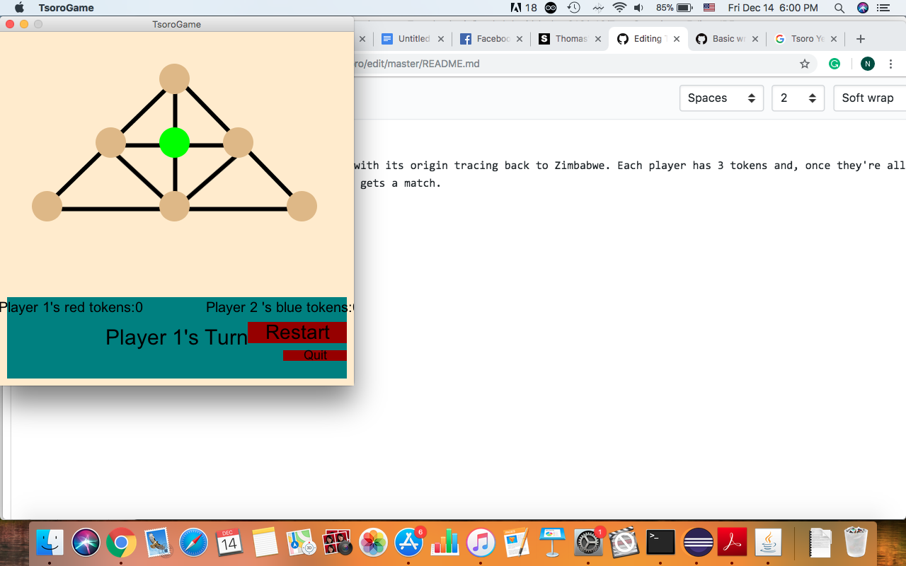

# Tsoro 

Tsoro is an African two-player strategy game, with its origin tracing back to Zimbabwe. Each player has 3 tokens and, once they're all placed, the player moves them around until one gets a match. 

## It first asks for your username

## Then you'll see Tsoro's home page!

# Then play along! 

